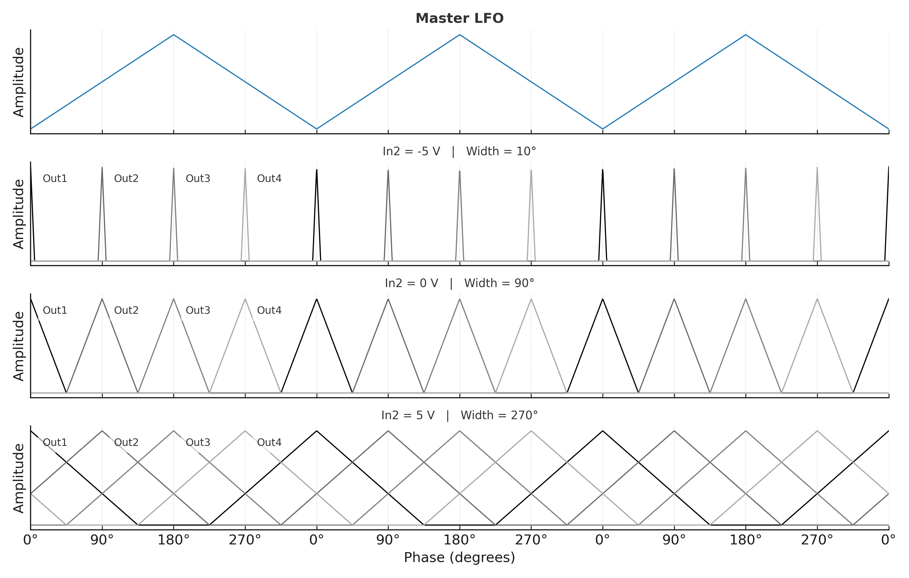

# RotatingCVs – Variable-Width Rotating LFO for Monome Crow

**Author:** Marcus Korb  
**Version:** 2.1  
**License:** MIT

RotatingCVs generates **four phase-shifted control voltages** (Out1..Out4, 90° apart) from a **master LFO**.

- **CV1 (In1)** controls rotation speed **bipolar** (direction & rate).  
- **CV2 (In2)** controls the **active lobe width** (bandpass-like shaping) in **degrees**.  
- Outputs swing around a **global voltage offset** that applies to all channels.  
- Choose **cosine** (smooth) or **triangle** (linear) lobes; optionally sharpen edges.

---

## ✨ Features
- **Four outputs, 90° phase-shifted**: Controlled by `channel_offsets = {0, 90, 180, 270}`.
- **Width control via CV2** (degrees over the LFO phase):  
  - **−5 V** → narrow lobe (default: 15°) → steep edges, silent gaps possible  
  - **0 V** → medium lobe (default: 90°) → standard crossfade  
  - **+5 V** → wide lobe (default: 360°) → strong overlap  
  Mapping is linear between these points and fully parameterized.
- **Global output offset**: Set `output_offset_volts` to shift the baseline for all channels (e.g., −5.0 → ±5 V swing; 0.0 → 0..+10 V swing). Outputs are clamped to ±10 V.
- **Lobe shapes**: `shape_mode = "cosine"` (default) or `"triangle"`, with optional `edge_exponent` to sharpen peaks.
- **Smooth outputs**: Per-channel slew via `slew_time` (default 0.02 s).

---

## 📦 Quick Start
1. Copy `RotatingCVs.lua` to your Crow and run it via Druid.
2. Patch your inputs and outputs:  
   - **In1** → CV source for speed (−5..+5 V; negative = reverse)  
   - **In2** → CV source for width (−5..+5 V)  
   - **Out1..Out4** → target modules (VCAs, panners, etc.)
3. Turn **CV2** and observe:  
   - Narrow → short isolated peaks  
   - Wide → all outputs heavily overlap

---

## ⚙ Parameters (in the script)

### Timing & Smoothing
```lua
local update_interval  = 0.01  -- seconds per tick
local slew_time        = 0.02  -- seconds (per output)
```
- Lower `update_interval` = smoother motion but more CPU load.  
- Increase `slew_time` for softer output changes.

### Speed (CV1)
```lua
local speed_deg_per_5v = 180.0 -- deg/sec at +5 V
-- In CV1 handler:
rotation_speed_dps = (vv / 5.0) * speed_deg_per_5v * 24
```
- `speed_deg_per_5v` sets the base speed at +5 V.  
- The `* 24` multiplier increases maximum rotation rate significantly.  
- One full rotation time = `360 / rotation_speed_dps` seconds.

### Width (CV2)
```lua
local width_at_neg5 = 15.0   -- deg at −5 V
local width_at_zero = 90.0   -- deg at  0 V
local width_at_pos5 = 360.0  -- deg at +5 V
```
- Linear interpolation between these three points.  
- Smaller `width_at_neg5` → narrower peaks and more gaps.  
- Larger `width_at_pos5` → broader overlap.

### Shape
```lua
local shape_mode    = "cosine" -- or "triangle"
local edge_exponent = 1.0      -- >1 to sharpen edges
```
- **cosine**: smooth shoulders.  
- **triangle**: linear slopes.  
- `edge_exponent > 1` sharpens transitions.

### Output Offset
```lua
local output_offset_volts = -5.0
```
- Moves the baseline voltage up or down for all outputs.  
- −5.0 → ±5 V swing  
- 0.0  → 0..+10 V swing  
- Clamped internally to ±10 V.

---

## 🔍 How Width Shaping Works
For each channel:
1. Compute the **signed phase difference** from the master phase.
2. If the difference lies **outside ±W/2**, gain = 0 → output stays at `output_offset_volts`.
3. If inside ±W/2, apply the chosen lobe shape:
   - **Triangle**: linear from 1 at center to 0 at ±W/2  
   - **Cosine**: smooth from 1 at center to 0 at ±W/2
4. Multiply gain by 10 V (for ±5 V swing), then add `output_offset_volts`.

Result:  
- Narrow width → outputs are mostly at baseline with occasional peaks.  
- Wide width → outputs overlap heavily for smooth blending.

---


## Signal Width Control

The following diagram shows the Master LFO and the four phase-shifted outputs (Out1–Out4)  
with different width settings controlled via **In2**:



> **Note:** For lossless scaling and zooming, see the  
> [SVG version](docs/rotating_cvs_diagram_technical_labeled_v2.svg).

---

## 🛠 Troubleshooting
- **Druid shows “Event queue full”**  
  - Increase `update_interval` (e.g., 0.015–0.02).  
  - Reduce `print()` statements in the script.  
  - Increase `slew_time` to smooth rapid changes.
- **Too slow/fast**  
  - Adjust `speed_deg_per_5v` or the multiplier `* 24` in the CV1 handler.
- **No gaps at narrow width**  
  - Ensure CV2 reaches near −5 V.  
  - Reduce `width_at_neg5` further (e.g., 10°).

---

## 📜 Changelog

### v2.1
- Fixed lobe width shaping (hard zero outside ±W/2).  
- Added global output offset with ±10 V clamp.  
- Higher speed headroom via ×24 scaling in CV1 handler.  
- Default shape = cosine; cleaned structure & comments.

---

## 📄 License
MIT License – see `LICENSE` file for details.
